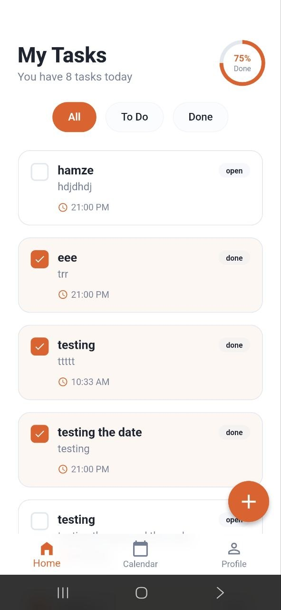
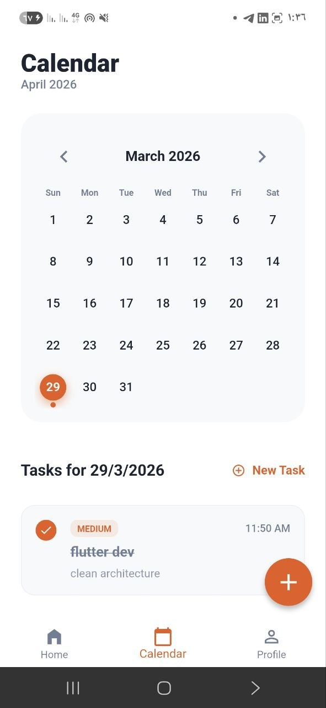
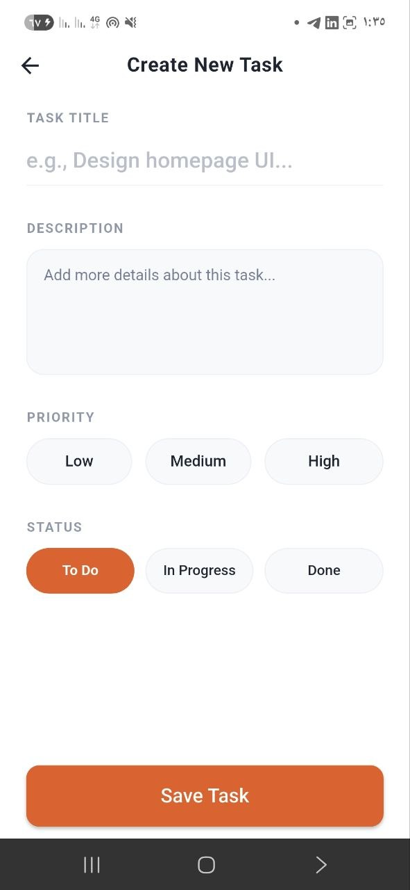
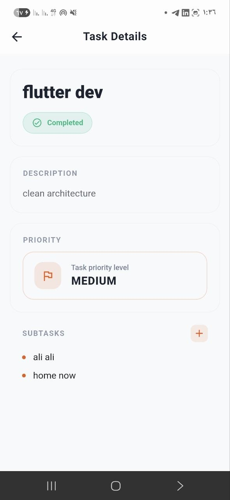
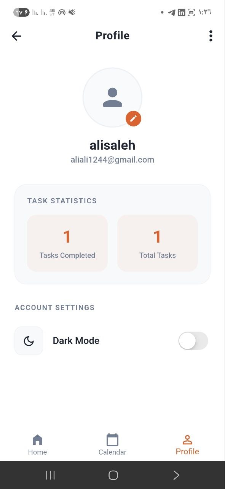
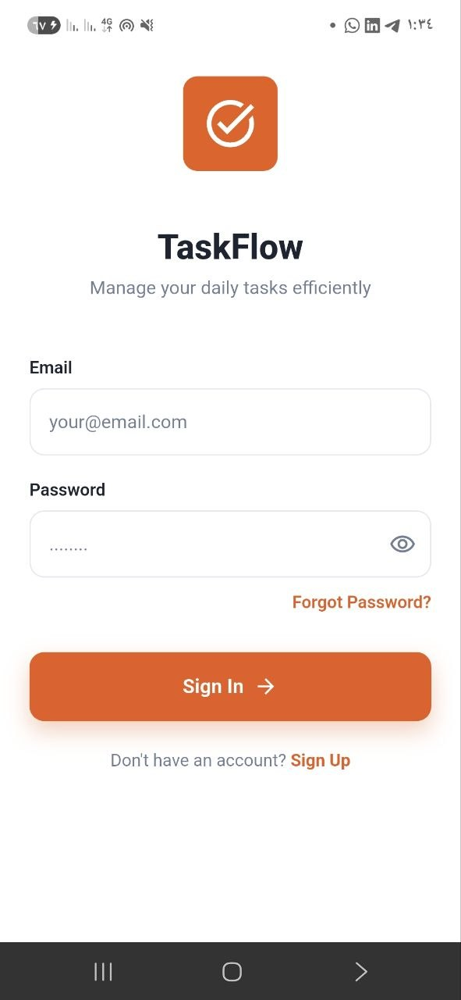

# TaskFlow ✅

تطبيق متكامل لإدارة المهام اليومية بفعالية وسهولة. تم تطوير التطبيق باستخدام إطار عمل **Flutter** مع تطبيق مبادئ **Clean Architecture** لضمان جودة الكود، قابليته للتطوير، وسهولة صيانته، بالإضافة إلى تغطية برمجية شاملة باستخدام **Unit Testing**.

---

## ✨ الميزات الرئيسية (Features)

* **نظام المصادقة (Authentication):** * إنشاء حساب جديد وتسجيل الدخول بسلاسة.
    * ميزة استعادة كلمة المرور (Forgot Password).
* **إدارة المهام (Task Management):**
    * إنشاء مهام جديدة مع تحديد العنوان، الوصف، والأولوية (منخفضة، متوسطة، عالية).
    * تحديد حالة المهمة (To Do, In Progress, Done).
    * إضافة مهام فرعية (Subtasks) لكل مهمة لتجزئة العمل.
* **لوحة التحكم والتقويم (Dashboard & Calendar):**
    * عرض المهام اليومية مع شريط تقدم يوضح نسبة الإنجاز (مثال: 100% Done).
    * تصفية المهام حسب الحالة (الكل، قيد الانتظار، المنجزة).
    * واجهة تقويم تفاعلية لاستعراض المهام المجدولة حسب الأيام والأشهر.
* **الملف الشخصي والإحصائيات (Profile & Stats):**
    * إحصائيات سريعة توضح إجمالي المهام والمهام المنجزة.
    * **دعم الوضع الليلي (Dark Mode):** إمكانية التبديل بين الوضع المضيء والليلي لتجربة مستخدم أفضل.

---

## 🛠️ التقنيات والهيكلية (Tech Stack & Architecture)

* **إطار العمل:** Flutter
* **الهيكلية:** **Clean Architecture** تم تقسيم المشروع إلى ثلاث طبقات رئيسية لضمان فصل الاهتمامات (Separation of Concerns):
    1.  **Presentation Layer:** تحتوي على واجهات المستخدم (UI) وإدارة الحالة (State Management).
    2.  **Domain Layer:** تحتوي على الكيانات (Entities) وحالات الاستخدام (Use Cases) والقواعد الأساسية للتطبيق (Business Logic).
    3.  **Data Layer:** مسؤولة عن جلب البيانات (Repositories, Data Sources) سواء من API خارجي أو قاعدة بيانات محلية.
* **الاختبارات (Testing):** تم تطبيق **Unit Testing** لاختبار حالات الاستخدام (Use Cases) والمنطق البرمجي لضمان خلو الكود من الأخطاء واستقراره.

---

## 📱 لقطات الشاشة (Screenshots)

> **ملاحظة:** قم برفع صور التطبيق داخل مجلد `assets/images/` في مستودعك، ثم استبدل الروابط أدناه.

| الرئيسية (Home) | التقويم (Calendar) | إضافة مهمة (Add Task) |
| :---: | :---: | :---: |
|  |  |  |

| تفاصيل المهمة (Task Details) | الملف الشخصي (Profile) | تسجيل الدخول (Sign In) |
| :---: | :---: | :---: |
|  |  |  |

---

## 🚀 كيفية تشغيل المشروع (Getting Started)

### المتطلبات المسبقة:
* تثبيت [Flutter SDK](https://flutter.dev/docs/get-started/install) (تأكد من توافق الإصدار).
* محرر أكواد مثل VS Code أو Android Studio.

### خطوات التشغيل:
1. قم باستنساخ المستودع:
   ```bash
   git clone [https://github.com/alisaleeh/taskflow.git](https://github.com/alisaleeh/task_flow.git)
